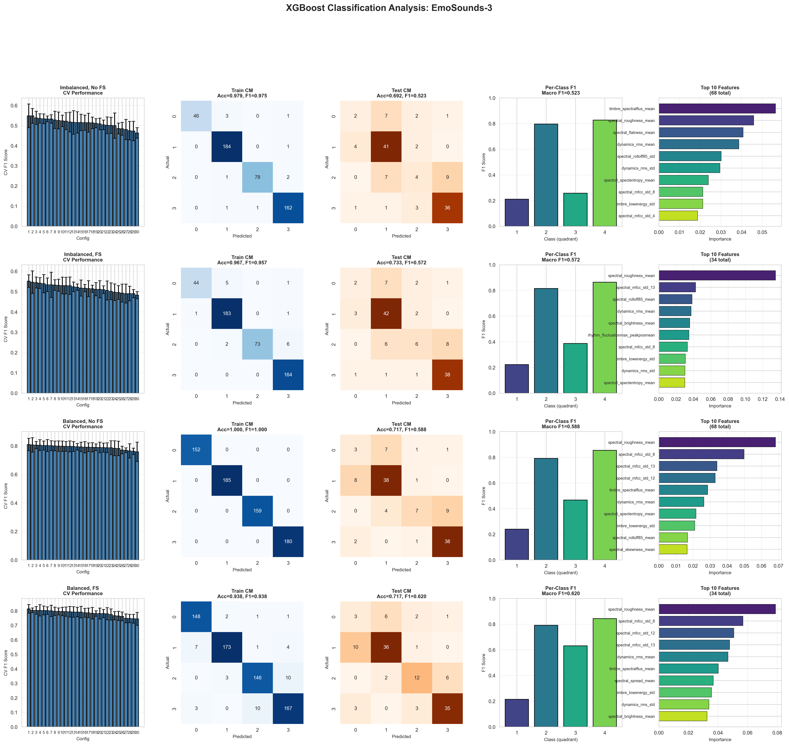
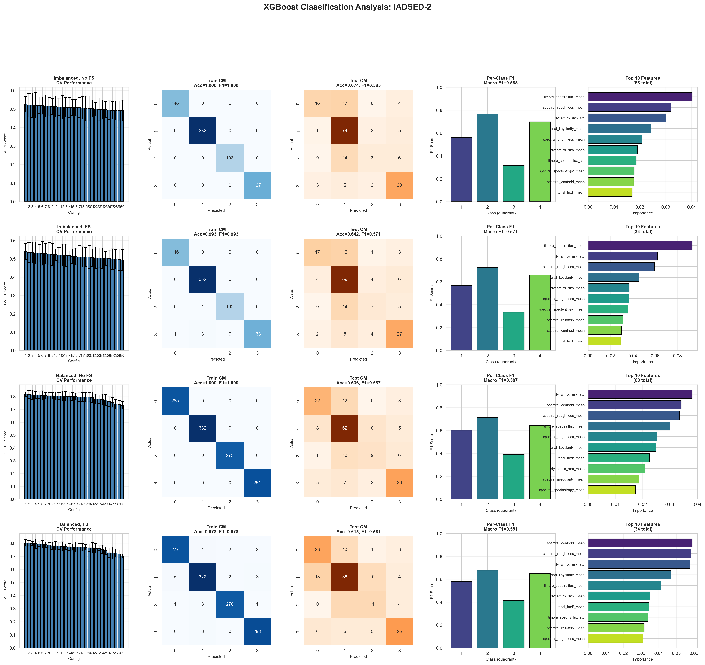
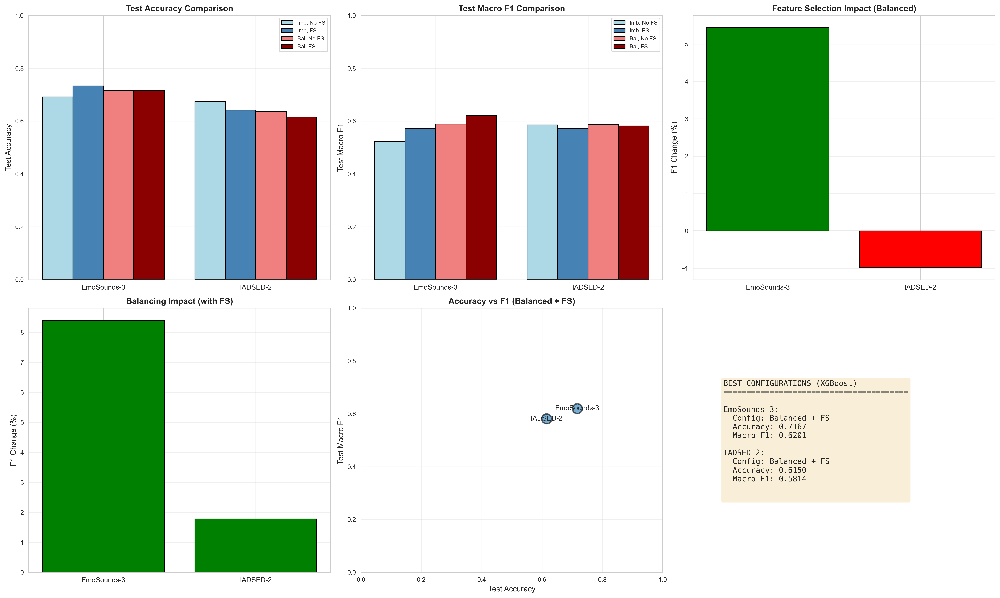
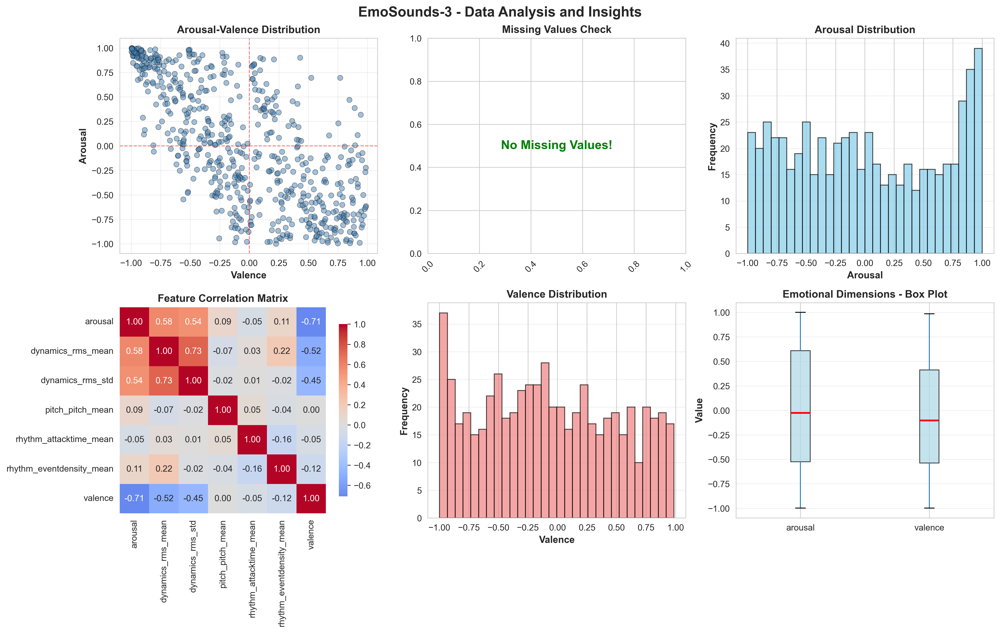
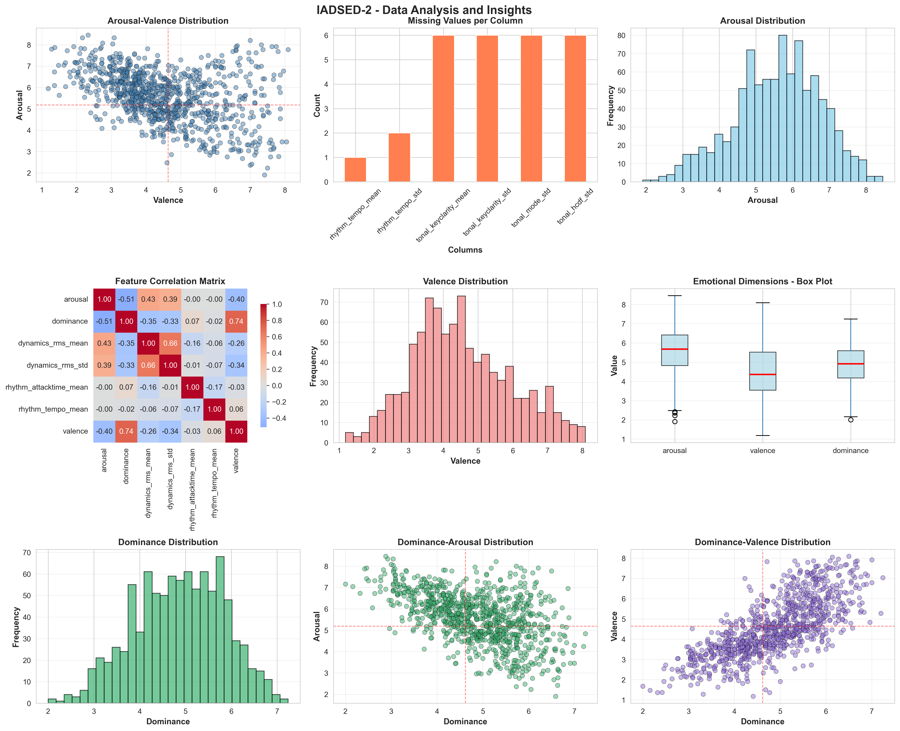

# CS273-HW2: Emotion Prediction from Acoustic Features

## Datasets
- **EmoSounds-3**: 600 samples, 75 acoustic features, bipolar scale (-1 to +1)
- **IADSED-2**: 935 samples, 76 acoustic features, Likert scale (1-9)

## Methods
- Preprocessing: Median imputation, Z-score standardization
- Feature engineering: Emotional intensity + quadrant features
- Split: 60% train / 20% validation / 20% test
- Models: Random Forest, XGBoost, DNN
- Balancing: SMOTE applied for comparison
- Feature selection: SelectKBest (k=34)

## Best Results

### EmoSounds-3
| Model | Configuration | Accuracy | Macro F1 |
|-------|--------------|----------|----------|
| **Random Forest** | Balanced + FS | 0.750 | **0.662** |
| XGBoost | Balanced + FS | 0.717 | 0.620 |
| DNN | Imbalanced + FS | 0.733 | 0.601 |

### IADSED-2
| Model | Configuration | Accuracy | Macro F1 |
|-------|--------------|----------|----------|
| **Random Forest** | Balanced + FS | 0.642 | **0.600** |
| XGBoost | Balanced + No FS | 0.636 | 0.587 |
| DNN | Imbalanced + FS | 0.599 | 0.551 |

## Key Findings
- **SMOTE balancing improved Macro F1 significantly** (>10% improvement in most cases)
- Feature selection provided modest gains when combined with balancing
- Random Forest performed best overall
- Negative arousal + negative valence classes were hardest to classify
- Class imbalance has greater impact than feature selection on performance

## Result Visualizations

### Random Forest Analysis

### XGBoost Analysis

### Deep Neural Network Analysis

### Data Visualizations

